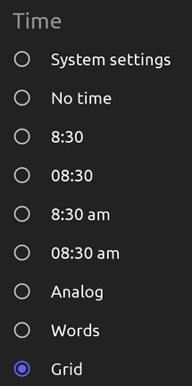
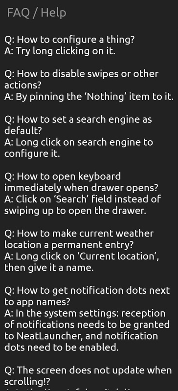
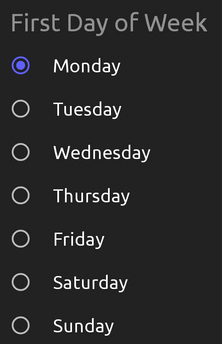
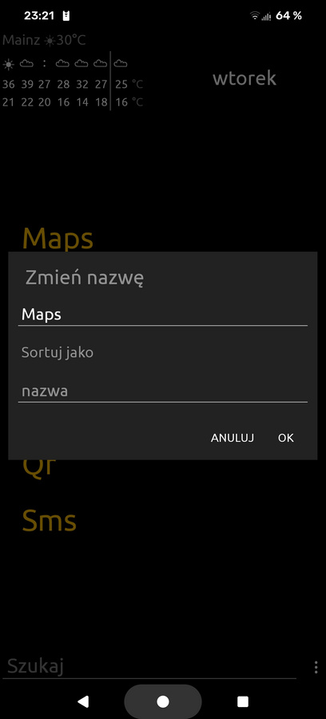
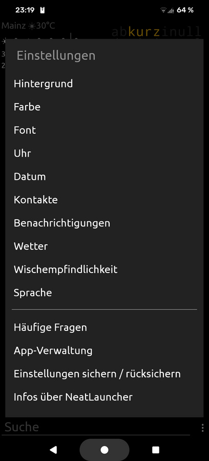
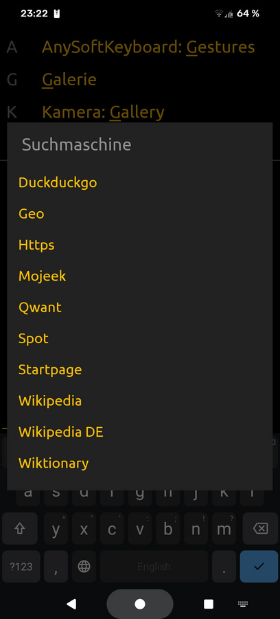
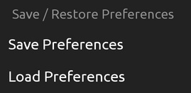

# NeatLauncher

A neat and convenient launcher without icons.

## Description

The new home app (the launcher) of your Android device to replace
ugly home apps that are too colourful, bright, distracting,
confusing, inefficient, and full of non-sensical icons.

Provides clarity by minimal, efficient, and elegant design based
on text. It allows to configure quick access to apps, shortcuts,
or contacts in different ways (including gestures), and it removes
confusing stuff from the home screen.

Supports shortcuts, integrates the contact list (if you want to),
and its search function includes a configurable web search.

For users who value clarity and straight design.

Tries to have enough configurability without making testing corner
cases tedious, to ensure functionality and robustness.

New app developed from scratch.

Takes inspiration from Unlauncher (a fork of Slimlauncher), and
Nolauncher, and also feedback of users.

## Features

  - uniform and elegant text-based design
  - configurable quick access links and gestures on home screen
  - shortcut support (long click on app by default)
  - hide/show apps (but keep searchable)
  - apps can be renamed and reordered
  - good search function for apps
  - integrated contact list search
  - integrated, configurable web search
  - clock options
  - date format options
  - weather forecast options (via open-meteo.com)
  - configurable colour scheme
  - can use system wallpaper as background
  - free open source software
  - no icon set support (no need: no icons at all)
  - no widget support

## Screenshots

