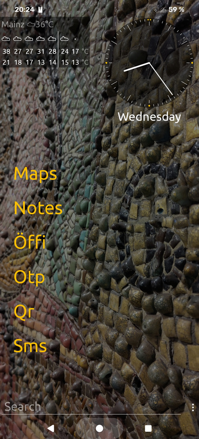
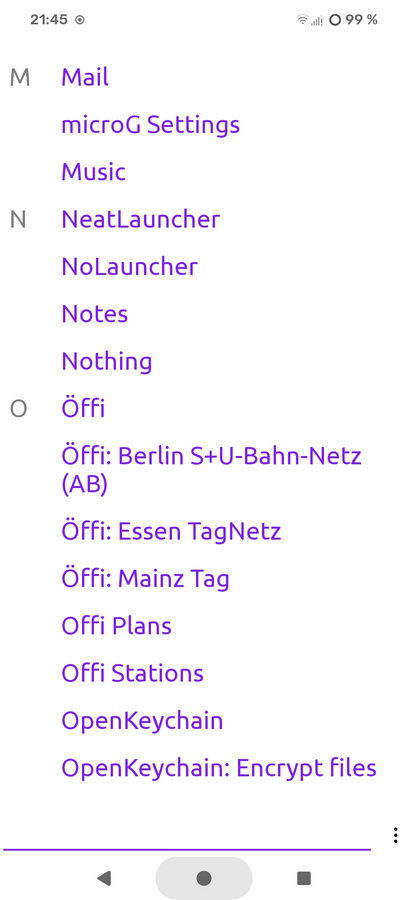
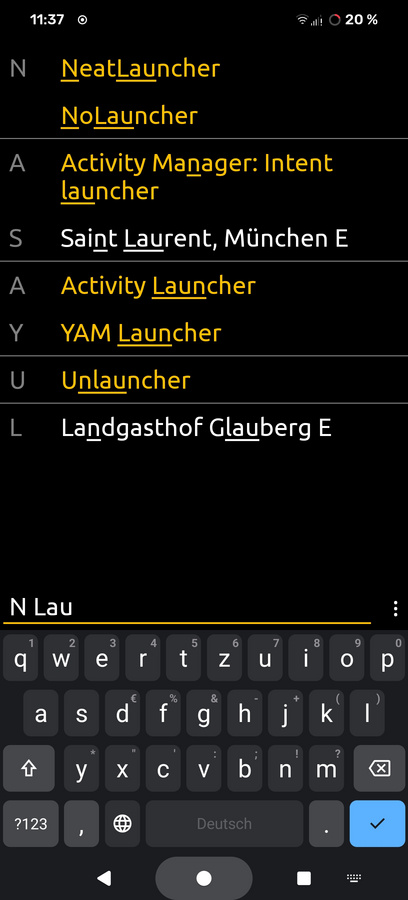
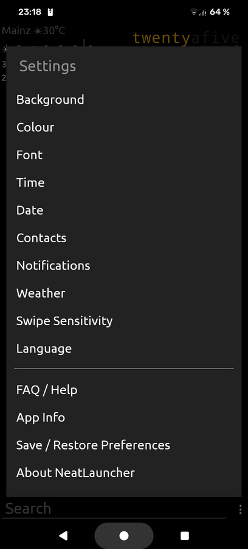
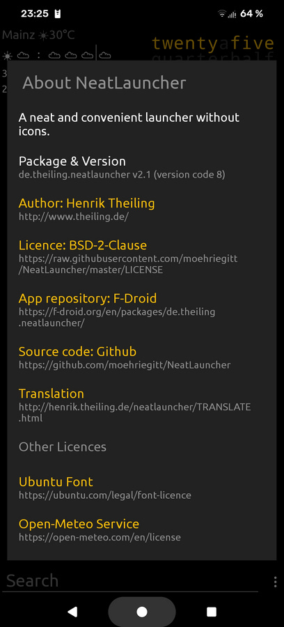

# NeatLauncher

A neat and convenient launcher without icons.

## Description

The new home app (the launcher) of your Android device to replace
ugly home apps that are too colourful, bright, distracting,
confusing, inefficient, and full of non-sensical icons.

Clarity by efficient and elegant design based on text. Gives quick
access to apps, shortcuts, or contacts via a list or by gestures.

Supports app shortcuts, both static and dynamic.

Optionally integrates the contact list.

Search function includes a configurable web search.

Tries to have enough configurability without making testing corner
cases tedious, to ensure functionality and robustness.

New app developed from scratch. Takes inspiration from Unlauncher
(a fork of Slimlauncher), and Nolauncher, and also feedback of
users.

## Features

  - uniform and elegant text-based design
  - configurable quick access links and gestures on home screen
  - shortcut support (long click on app by default)
  - hide/show apps (but keep searchable)
  - apps can be renamed and reordered
  - good search function for apps
  - integrated contact list search
  - integrated, configurable web search
  - clock options
  - date format options
  - weather forecast options (via open-meteo.com)
  - configurable colour scheme
  - can use system wallpaper as background
  - free open source software
  - no icon set support (no need: no icons at all)
  - no widget support

[Help Translate!](http://henrik.theiling.de/neatlauncher/TRANSLATE.html)

## Screenshots

